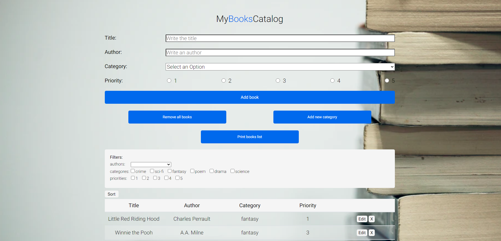

# MyBooksCatalog

This app is a simple book catalog where you can create books list you want to read. After you add some books you have options to:
- delete them or whole the list,
- edit them,
- add new categories,
- print/save a list,
- sort / filter,
- see quantity of each category. 
 I created it using technologies such as like HTML5, CSS, SASS, Vanilla Javascript, webpack.
 Data saves in local storage. On the first opening, the list fills on book samples.

# <h1> Live preview </h1>
https://dreamy-mirzakhani-f85deb.netlify.app/

# <h1>Setup on your machine (requirements : installed Node.js) </h1>
1. Clone repository, 
2. On your terminal use commend: npm i, 
3. and then: npm start

### `npm start`

Runs the app in the development mode.\
Open [http://localhost:8080](http://localhost:8080) to view it in the browser.

The page will reload if you make edits.\
You will also see any lint errors in the console.
